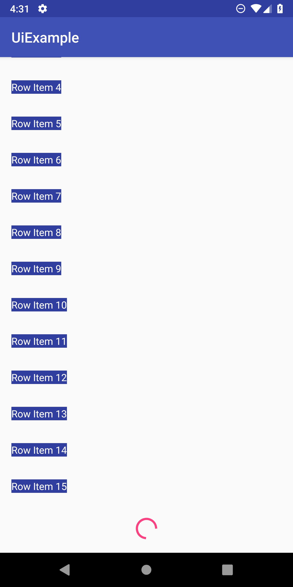
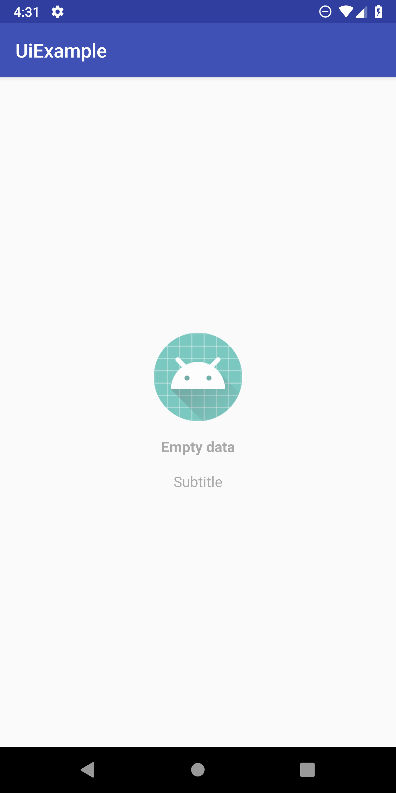
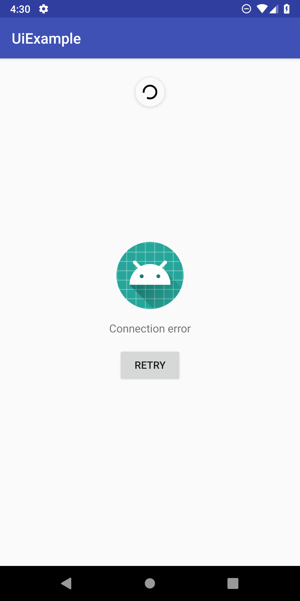

<p align="center"></p>

# Winkit Ui

 

An android ui library that provide useful classes to speed up the implementation.

Complete documentation [Here](https://winkgroup.github.io/winkit-android-ui/ui/winkit.android.ui/).

### Install

**1** Add the JitPack repository to your root build.gradle at the end of repositories

```groovy
allprojects {
  repositories {
    ...
    maven { url 'https://jitpack.io' }
  }
}
```

**2** Add the dependency

```groovy
dependencies {
	implementation 'com.github.WINKgroup:winkit-android-okcore:0.0.1'
}
```

## Views

### PaginatedRecyclerView [docs](https://winkgroup.github.io/winkit-android-ui/ui/winkit.android.ui/-paginated-recycler-view/) 
An helpful View that implement a RecyclerView with pullToRefresh and Loadmore feature. This recyclerView ask in a callback the pages and allow to implement the “no data” and “error” state.

<p align="center">
	
	
	
</p>

Xml declaration:

```xml
<winkit.android.ui.PaginatedRecyclerView
    android:id="@+id/paginatedRecycler"
    android:layout_width="match_parent"
    android:layout_height="match_parent"
    app:empty_title="Empty data"
    app:empty_subtitle="Subtitle"
    app:empty_icon="@mipmap/ic_launcher"
    app:error_icon="@mipmap/ic_launcher"/>
```

Kotlin implemention:

```kotlin
paginatedRecycler.adapter = adapter
paginatedRecycler.getPageListener = getPage@{ index: Int ->
    getRandomData(index) { data ->
        Log.d("DATA!", "${data?.size}")
        if (data != null) {
            adapter.append(data)
            paginatedRecycler.haveMore = !data.isEmpty() && adapter.getRowsCount() < 40

            adapter.notifyDataSetChanged()
        } else {
            if(index == 0)
                adapter.showError("Errore di connessione")
            else {
                paginatedRecycler.haveMore = false
                Toast.makeText(this, "Errore di connessione", Toast.LENGTH_SHORT).show()
            }
        }
    }
}
paginatedRecycler.requestFirstPage()
```
